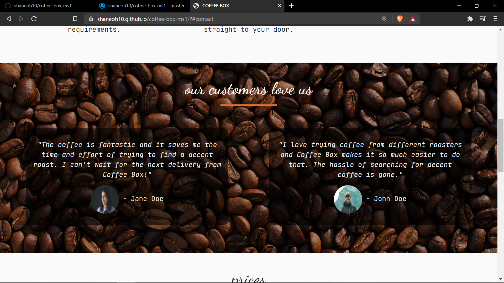

# Website for Coffee Box

## Code Institute Milestone Project 1 : User-Centric Front End Development

Coffee Box is a fictional company that offers a monthly coffee delivery subscription service.  The website will contain information on the services offered by Coffee Box with the goal of acquiring new customers to sign up for the service. The website will have a warm, friendly feel to it which will encourage users to trust Coffee Box and sign up to the service. Users will have access to a contact form to easily send any queries relating to the service directly to Coffee Box.

A link to the live website can be found [here](https://shaneoh10.github.io/coffee-box-ms1/)

## UX

## Strategy

The Coffee Box website is for users who are looking to purchase boutique coffee on a monthly recurring delivery subscription.  The users may be looking to purchase coffee monthly for personal use at home or they may want to purchase once off as a gift or a trial run of the service. So as not to limit the services of Coffee Box to specific customers the website will entice all coffee lovers to subscribe to the service. Although the service is not limited to a target audience, one specific group may be professional individuals who are working from home and are looking for a delivery service to keep their coffee supply topped up from month to month.  The users of the Coffee Box website will want to see clear information about the service (price, amount of coffee, frequency of deliveries/charges) so that they can choose the subscription that best fits their budget and coffee requirements.

#### As a user I want to:
* view various subscription costs to determine if the service is within budget.
* view a simple breakdown of information on how the service works.
* be able to view the website on various devices (mobile, tablet, desktop)
* easily contact Coffee Box with any queries regarding the service.
* view testimonials from staisfied customers to authenticate the services of Coffee Box.
* be able to instinctively navigate the website to efficiently find any information required.
* be easily directed to any social media channels to connect with Coffee Box to stay up to date with any offers or other viewing material.

## Scope 

After analysis of the user stories, I have decided on the following features to be my initial minimum scope:
* Responsive design 
* Subscription service information and prices
* Information on how it works
* Satisfied customer testimonials
* Contact form
* Links to social media channels

## Structure

I decided to keep the structure of the website similar to what users will have previously experienced and so I researched other coffee subscription websites in order to keep up with current structure trends. I found that a lot of websites were one-page scrollers but did not use a traditional navbar, so I decided to opt for the one-page scroller structure with a traditional navbar to give users a friendly and familiar experience while using the site.

I have structured the site with: 
* A brand logo on the left and navbar to the right as users would be familiar with
* A collapsible navbar hamburger icon to save screen space on smaller devices
* One-page scroller with each section leading on to the next, users should not feel lost
* Social media icons on the footer
* Main content written using bootstrap for mobile first responsive design

## Skeleton

I used Balsamiq to design wireframes for mobile, tablet and desktop. These wireframes can be viewed [here](https://github.com/shaneoh10/coffee-box-ms1/blob/master/assets/documents/coffee-box.pdf)

## Surface 

#### Colours

I chose a warm neutral colour palette to contrast with earthy background images to create a relaxed and comfortable feel, as would be associated with enjoying a cup of coffee.

* #FAFAFA - off white colour
* #E17131 - Spanish orange
* #FFCB97 - Peach crayota
* #E8E8E8 - Platinum
* #D3D0CB - Timberwolf
* #F0EFEB - Isabelline
* #65524D - Umber

#### Typography 

I have chosen JetBrains Mono as the main font throughout the website and Dancing Script for the main headers to provide the users with a friendly and welcoming feel.

## Features 

#### Across the page: 
* The navbar will be visible across the whole web page with a feature where it is hidden on scroll down and re-appears at the top of the screen when the user begins to scroll up. The navbar shows the Coffee Box logo on the left and there are four website sections available to travel to on the right-hand side: Home, About, Prices, Contact Us. The navbar also collapses into a hamburger icon on smaller screens.

#### Home Section: 
* A background image of a cup of coffee and coffee beans. This high-quality image will give users a first impression of a warm and welcoming professional service.  The image also ties in with the warm and earthy colour palette chosen for the site.
* A central main heading containing the company slogan and sub-heading providing a brief description of the service, quickly draw user attention to the centre of the page.
* Two buttons, a sign-up call-to-action and a tell me more button to encourage users to either sign up to the service or continue to browse the website to learn more about the service.  The sign-up button is an orange colour to attract user attention.

#### About Section: 
* This section contains information in three simple steps how the Coffee Box service works. The process of how the service works is broken down to three steps so customers understand how it works and how simple and convenient it is to use.

#### Testimonials Section:
* This section contains 2 testimonials from satisfied customers explaining how they love the service. The purpose of this section is to give users confidence in Coffee Box as a company and in the service it provides.

#### Prices 
* The prices section is where users can see the various subscription services on offer. Each subscription option contains the price and the amount of coffee received per month so that users can decide based on their coffee requirement and budget. The sign-up buttons open a bootstrap modal prompting users to sign up, but this modal does not have any function at this stage. The modal can be closed by clicking the close button or by clicking anywhere outside the modal.

#### Contact Section: 
* A Bootstrap contact form with space for name, email, message, and option to subscribe to newsletter. There is a button to send placed at the bottom of the form.
* The name and email fields are required, and the email will have to be the correct format to be submitted.

#### Footer:
* The footer includes social media links to Facebook, Instagram, LinkedIn and Twitter, and a copyright notice. I decided to have minimal content in the footer so that the users’ attention would not be drawn away from the main page content.

## Technologies Used
* HTML5 - This is the main language of the website content
* CSS3 - This is used to style the web pages
* Bootstrap v4.5 - The project uses Bootstrap elements to help with form and design
* JavaScript, jQuery - Used to implement the functionality of the burger button and the navbar appear on scroll up feature
* GitHub - Used to store the code and host the live website
* Gitpod - This is the IDE I used for the project
* Git - Used within Gitpod as the version control system
* Chrome Developer Tools - Used within Google Chrome to inspect the web pages. This is helpful when designing responsive features and troubleshooting bugs.
* Balsamiq - I created the project wireframes with this software
* Google Fonts - Used to import multiple fonts to the project
* Fontawesome.com - Used to import icons
* Techsini.com - Used this website to generate the multi-device website mockup

## Testing

I used Chrome Developer Tools throughout the entire project when making any changes to CSS or HTML. It is a great tool for seeing how changes will look on various screen sizes and for testing the website responsiveness to different device types. I found it very useful when deciding font sizes and positioning of sections and content to help me with providing the best user experience on mobile devices and on desktop. As it was a mobile first design, by testing with Chrome Developer Tools I added a lot of media queries to improve the experience on larger screen sizes. I am happy with the design of the website and I think that it is clear and easy to read on mobile, tablet and desktop devices.

When I first viewed the website home page on Chrome Developer Tools I noticed that because the website was designed for mobile first, the heading and navbar text was small and difficult to read. To improve the user experience I added media queries to increase the font size of all headings and text on larger devices.

I also encountered an issue with the navbar item text. On certain larger screen sizes, when hovering on nav items, all the nav items would get pushed upwards which visually was not appealing and hindered the user experience. I adjusted the CSS and upon further testing the issue was resolved.

I used lighthouse to run final tests on the website. It was flagged that the website did not have a meta description, an issue which I resolved following the test. It was also flagged that the website performance was being affected by the large file size of the testimonial images. I replaced these images with similar images of a much smaller file size to enhance website performance and reduce loading times.

One criticism I have is that I feel that the website is a bit cramped in some sections on larger screen sizes but with a mobile first design in mind I am happy with the project overall.

### W3C Validator Testing

I ran validator tests at the end of the project with the W3C Validator for both HTML and CSS. Here is an example of the HTML errors that I found:

I investigated and corrected these errors and on the final test there were no errors found for HTML.

When testing my CSS I came across the following errors:

These errors are in the Bootstrap CDN and are therefore out of my control. I ran my own CSS through the tester via direct input and no errors were found.

### Web Browser and Device Testing

I have viewed the website on Google Chrome and Firefox on my laptop and on a larger desktop screen and I found no issues with the features or the viewing experience. 

Although I had already tested the website for various device sizes on Chrome Developer Tools, I also tested the website on a Samsung Galaxy S9 mobile phone to verify the results and everything works and looks OK.

### Testing User Stories

#### I want to view various subscription costs to determine if the service is within budget

1. Go to Home page
2. Scroll to Prices section or click on Prices on navbar
3. User can view information on subscription options and prices and choose as they wish

#### I want to view a simple breakdown of information on how the service works

1. Go to Home page
2. Scroll to About section, click About on navbar, or click on Tell Me More button in the centre of the screen
3. User can view a breakdown of information on how the service works

#### I want to be able to view the website on various devices (mobile, tablet, desktop)

1. Website has been tested and works on various devices so user should be able to access the website on any device they use

#### I want to easily contact Coffee Box with any queries regarding the service

1. Scroll to or click on Contact on the navbar to go to the Contact section
2. User can now view a contact form
3. User can fill out form with name, email, message and checkbox if they want to subscribe to newsletter
4. Click submit to send form, form will only send if Name field is filled and email is in correct format
5. Subscribe to newsletter is not required, it is entirely up to the user

#### I want to be able to instinctively navigate the website to efficiently find any information required

1. As user scrolls down through page all relevant information is layed out in hierarchy of importance
2. User can instantly go to a section of the page by clicking that section on the navbar
3. Navbar re-appears when the user scrolls up at any point on the page to allow user the option to travel to the desired section

#### I want to view testimonials from staisfied customers to authenticate the services of Coffee Box

1. Go to Home page
2. Scroll down through website content and below the About section the testimonials are visible
3. Alternatively, when a user travels directly to About section the testimonials are visible at the bottom of the screen on larger devices hinting the user to scroll down

#### I want to be easily directed to any social media channels to connect with Coffee Box to stay up to date with any offers or other viewing material

1. All social media icons are clearly displayed on the footer of the website
2. I Individually checked each icon to verify that when clicked it brings the user to the correct social media website

### Deployment

The Coffee Box website was deployed on GitHub using the following setup:
1. Throughout the project I saved all my code to Git by typing `git add .` into the terminal.
2. To commit the code to git I used the command  `git commit -m "add comment here" -a `
3. Using Git I then used the command `git push` to push all the committed code to my GitHub repository at [https://github.com/shaneoh10/coffee-box-ms1](https://github.com/shaneoh10/coffee-box-ms1)
4. Opened the settings tab in the repository.s
5. Scrolled down to "Github Pages" section in settings.
6. Selected "main" branch and "root" folder and pressed "Save" to deploy project to GitHub pages. Website is now live.
7. Clicked on the new link provided to view the live website. [https://shaneoh10.github.io/coffee-box-ms1/](https://shaneoh10.github.io/coffee-box-ms1/)
8. The live website is automatically updated every time a new commit is pushed to the project repository.

The project can be downloaded as a .zip file by clicking on the "Code" button in the project repository and then clicking "Download ZIP". 

Alternatively the project can be cloned by entering `git clone git@github.com:shaneoh10/coffee-box-ms1.git` in the terminal. 

More information on cloning the project can be found [here](https://docs.github.com/en/free-pro-team@latest/github/creating-cloning-and-archiving-repositories/cloning-a-repository).

### Credits

#### Code
* Navbar hamburger icon collapse on menu item click - code credit to [this post](https://mdbootstrap.com/support/general/auto-close-navbar-when-click-on-link-responsive-mode/) on mdbootstrap.com
* Navbar hide on scroll down and appear on scroll up - code credit to [this post](https://www.w3schools.com/howto/howto_js_navbar_hide_scroll.asp) on w3schools.com
* The bootstrap modal was copied from [here](https://getbootstrap.com/docs/4.5/components/modal/) and edited to suit my project
* The contact form was copied from [here](https://getbootstrap.com/docs/4.5/components/forms/) and edited to suit my project
* The use of REM units for responsive sizing was inspired by [this article](https://engageinteractive.co.uk/blog/em-vs-rem-vs-px) by Simon Willans
* The use of the Sign Up Modal was inspired by the Code Institute's Whiskey Drop walkthrough project as part of the User Centric Front End Development module

#### Photos

All photos were sourced from [Unsplash.](https://unsplash.com/) Photos and artist links below:
* [Janko Ferlic - @itfeelslikefilm](https://unsplash.com/photos/h9Iq22JJlGk)
* [Mike Kenneally - @asthetik](https://unsplash.com/photos/TD4DBagg2wE)
* [Sigmund - @sigmund](https://unsplash.com/photos/jzz_3jWMzHA)
* [Ben den Engelsen - @benjeeeman](https://unsplash.com/photos/YUu9UAcOKZ4)

#### Content 

All other written content throughout the website is entirely fictional and was written by myself.

### Acknowledgements 

I would like to thank my mentor Spencer Barriball for his help and guidance throughout the project. I would also like to thank Code Institute and the Slack community for providing me with ideas and inspiration on to how to approach the project.